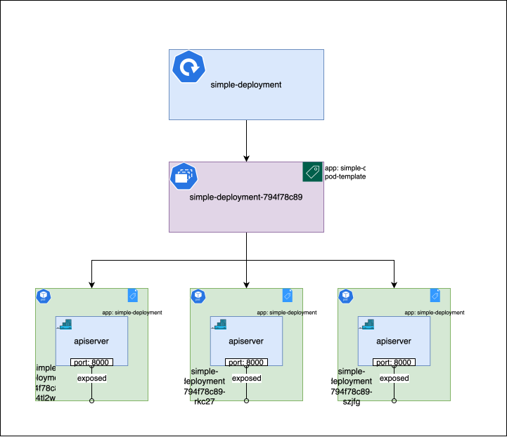

# Deployments

A [Deployment](../chapter-1/deployments.md) manages Replica Sets. It helps manage the lifecycle of the application by providing features like rolling updates, rollbacks, and scaling.

## Managing applications with Deployments

Deployments create Replica Sets, which in turn create and manage Pods. Deployments are used to manage the lifecycle of Pods. They help in creating new Pods, updating existing Pods, and deleting old Pods.

Let's create a Deployment for the simple REST API server we created earlier. Navigate to the `simple-deployment` directory:

```bash
cd bootstrapping-with-kubernetes-examples/deploy/simple-deployment
```

The `deployment.yaml` file in this directory contains the following configuration:

```yaml
apiVersion: apps/v1
kind: Deployment
metadata:
  name: simple-deployment
spec:
  replicas: 3
  selector:
    matchLabels:
      app: simple-deployment
  template:
    metadata:
      labels:
        app: simple-deployment
    spec:
      containers:
      - name: apiserver
        image: rutush10/simple-restapi-server-py:v0.0.1
        ports:
        - containerPort: 8000
        resources:
          requests:
            cpu: 100m
            memory: 100Mi
          limits:
            cpu: 200m
            memory: 200Mi
```

Create the Deployment by running the following command:

```bash
kubectl apply -f deployment.yaml
```

You can check the status of the Deployment using the following command:

```bash
kubectl get deployments
```

```shell
$ kubectl get deployments
NAME                READY   UP-TO-DATE   AVAILABLE   AGE
simple-deployment   3/3     3            3           17s
```

This deployment creates a Replica Set. 

```shell
NAME                          DESIRED   CURRENT   READY   AGE   LABELS
simple-deployment-794f78c89   3         3         3       76s   app=simple-deployment,pod-template-hash=794f78c89
```

The Replica Set, in turn, creates and manages Pods. 

```shell
NAME                                READY   STATUS    RESTARTS   AGE    LABELS
simple-deployment-794f78c89-4tl2w   1/1     Running   0          107s   app=simple-deployment,pod-template-hash=794f78c89
simple-deployment-794f78c89-rkc27   1/1     Running   0          107s   app=simple-deployment,pod-template-hash=794f78c89
simple-deployment-794f78c89-szjfg   1/1     Running   0          107s   app=simple-deployment,pod-template-hash=794f78c89
```

You can see that the Replica Set created by the deployment has an additional label `pod-template-hash`. This label is used by the Deployment Controller to manage Replica Sets when you make changes to the Deployment.

Let's see how to update the Deployment with a new version `v0.0.2` of the simple REST API server.

## Updating the Deployment

To update the Deployment, you need to change the image version in the `deployment.yaml` file. 

Update the `deployment.yaml` file as shown below: 

```yaml
apiVersion: apps/v1
kind: Deployment
metadata:
  name: simple-deployment
spec:
  replicas: 3
  selector:
    matchLabels:
      app: simple-deployment
  strategy:
    type: RollingUpdate
    rollingUpdate:
      maxUnavailable: 1
      maxSurge: 1
  template:
    metadata:
      labels:
        app: simple-deployment
    spec:
      containers:
      - name: apiserver
        image: rutush10/simple-restapi-server-py:v0.0.2
        ports:
        - containerPort: 8000
        resources:
          requests:
            cpu: 100m
            memory: 100Mi
          limits:
            cpu: 200m
            memory: 200Mi
```

Apply the changes to the Deployment:

```bash
kubectl apply -f deployment.yaml
```

You can check the status of the Deployment using the following command:

```shell
$ kubectl get pods --show-labels
NAME                                READY   STATUS              RESTARTS   AGE   LABELS
simple-deployment-794f78c89-4tl2w   1/1     Running             0          13m   app=simple-deployment,pod-template-hash=794f78c89
simple-deployment-794f78c89-rkc27   1/1     Terminating         0          13m   app=simple-deployment,pod-template-hash=794f78c89
simple-deployment-794f78c89-szjfg   1/1     Running             0          13m   app=simple-deployment,pod-template-hash=794f78c89
simple-deployment-98d7d96b-dxc25    0/1     ContainerCreating   0          2s    app=simple-deployment,pod-template-hash=98d7d96b
simple-deployment-98d7d96b-w46tx    0/1     ContainerCreating   0          2s    app=simple-deployment,pod-template-hash=98d7d96b
```

You can see that the Deployment is updating the Pods. The old Pods are being terminated, in a controlled manner such that at least one Pod is available at all times. The new Pods are being created with the updated image version `v0.0.2`.


## Understanding the Deployment manifest

Let's break down the `deployment.yaml` file:

- `apiVersion: apps/v1`: This tells Kubernetes to use the `apps/v1` API group.
- `kind: Deployment`: This specifies the type of object we're creating, which is a Deployment.
- `metadata`: This field specifies the additional metadata that should be associated with the Deployment.
    - `name`: This field specifies the name of the Deployment. In this case, it's `simple-deployment`.
- `spec`: This field specifies the desired state of the Deployment.
    - `replicas: 3`: This field specifies the number of Pods that should be running at all times. In this case, it's `3`.
    - `selector`: This field specifies how the replica set created by the Deployment should select the Pods it manages.
        - `matchLabels`: This field specifies the labels that the replica set should match to manage the Pods. In this case, it's `app: simple-deployment`.
    - `template`: This field specifies the Pod template that should be used to create the Pods.
        - `metadata`: This field specifies the labels that should be attached to the Pods created by the Deployment.
            - `labels`: This field specifies the labels attached to the Pods. In this case, the Pods are labeled with `app: simple-deployment`.
        - `spec`: This field specifies the desired configuration of the Pods.
            - `containers`: This field specifies the containers that should run in the Pods.
                - `name: apiserver`: This field specifies the name of the container. In this case, it's `apiserver`.
                - `image: rutush10/simple-restapi-server-py:v0.0.1`: This field specifies the image that should be used for the container. In this case, it's `rutush10/simple-restapi-server-py:v0.0.1`.
                - `ports`: This field specifies the ports that should be exposed by the container.
                    - `containerPort: 8000`: This field specifies the port `8000` should be exposed by the container.
                - `resources`: This field specifies the resource requests and limits for the container. In this case, it's `100m` CPU and `100Mi` memory for requests, and `200m` CPU and `200Mi` memory for limits.



You can learn more about the Deployment spec [here](https://kubernetes.io/docs/reference/generated/kubernetes-api/v1.26/#deployment-v1-apps).


## Cleaning up

To clean up the resources created in this section, run the following commands:

```bash
kubectl delete -f deployment.yaml
```

## Summary

In this section, you learned about Deployments and how they help you manage the lifecycle of Pods. You saw how Deployments create Replica Sets and manage Pods. You also learned how to update a Deployment with a new version of the application. Finally, you learned how to write a Deployment manifest and create a Deployment using `kubectl`.
