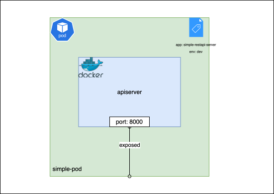

# Pods

[Pods](../chapter-1/pods.md) are the smallest deployable units you'll create in Kubernetes. We already know what a pod is, so let's go ahead and create a pod. 

Navigate to the `simple-pod` directory:

```bash
cd bootstrapping-with-kubernetes-examples/deploy/simple-pod
```

The `pod.yaml` file in this directory contains the following configuration (I've updated the labels here):

```yaml
apiVersion: v1
kind: Pod
metadata:
  name: simple-pod
  labels:
    env: dev
    app: simple-restapi-server
spec:
  containers:
  - name: apiserver
    image: rutush10/simple-restapi-server-py:v0.0.1
    ports:
    - containerPort: 8000
    resources:
      requests:
        memory: "64Mi"
        cpu: "250m"
      limits:
        memory: "128Mi"
        cpu: "500m"
```

To create the pod, run:

```bash
kubectl apply -f pod.yaml
```

To check if the pod is running, run:

```bash
kubectl get pods
```

It should give the following output:

```shell
$ kubectl get pods
NAME         READY   STATUS    RESTARTS   AGE
simple-pod   1/1     Running   0          60m
```

## Understanding the pod manifest

Now let's understand the specifications in the `pod.yaml` file:

- `apiVersion`: This field specifies where the object is defined. In this case, it's defined in the `v1` version of the Kubernetes API. This field is mandatory for all Kubernetes objects as it helps the API server to locate the object definition.
- `kind`: This field specifies the type of object you're creating. In this case, it's a `Pod`.
- `metadata`: This field specifies the additional metadata that should be associated with the pod. 
    - `name`: This field specifies the name of the pod. In this case, it's `simple-pod`.
    - `labels`: This field specifies the labels attached to the pod. Labels are key-value pairs that can be used to filter and select resources. In this case, the pod is labeled with `env: dev` and `app: simple-restapi-server`.
- `spec`: This field specifies the desired configuration of the pod. 
    - `containers`: This is a list of containers that should be run in the pod. In this case, there's only one container named `nginx`. For every container you specify in the pod, the following fields are mandatory:
        - `name`: This field specifies the name of the container. In this case, it's `apiserver`.
        - `image`: This field specifies the image that should be used to create the container. In this case, it's `rutush10/simple-restapi-server-py:v0.0.1`.
        - `ports`: This field specifies the ports that should be exposed by the container. In this case, the container is exposing port `8000`.
        - `resources`: This field specifies the resource requirements and limits for the container. In this case, the container requires a minimum of `64Mi` memory and `250m` CPU and can use a maximum of `128Mi` memory and `500m` CPU.

To simply say, we are telling Kubernetes to create a pod named `simple-pod` with a single container named `apiserver` that runs the `rutush10/simple-restapi-server-py:v0.0.1` image and exposes port `8000`. The pod is also labeled with `env: dev` and `app: simple-restapi-server`.



You can read more about the pod spec [here](https://kubernetes.io/docs/reference/generated/kubernetes-api/v1.26/#pod-v1-core). 


## Cleaning up

To delete the pod, run:

```bash
kubectl delete -f pod.yaml
```

## Summary

In this section, you learned how to create a pod in Kubernetes. You saw how to write a pod manifest and create a pod using `kubectl`. You also learned about the different fields in the pod manifest and what they mean.