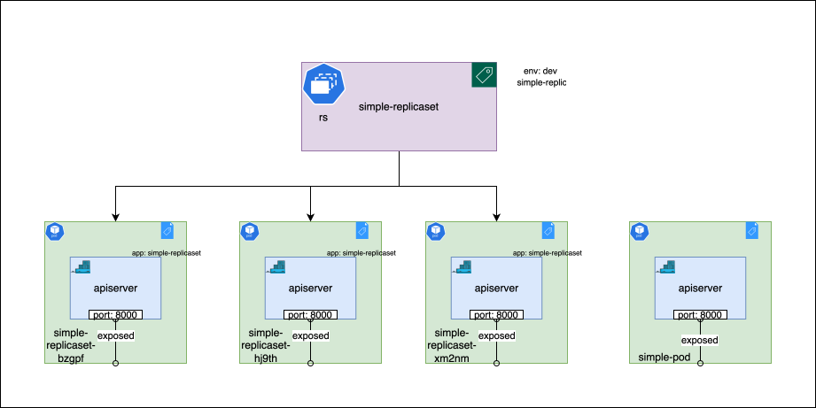

# Replica Sets

Replica Sets are the resources that help you make sure that a specific number of pods are running at any given time. If a pod fails, the Replica Set will create a new one to replace it. 

## Managing pods with Replica Sets

Replica Sets use selectors, like labels, to identify the pods they should manage. When you create a Replica Set, you specify a selector. This selector tells the Replica Set which pods to manage. 

Navigate to the `simple-replicaset` directory:

```bash
cd bootstrapping-with-kubernetes-examples/deploy/simple-replicaset
```

The `replicaset.yaml` file in this directory contains the following configuration:

```yaml
apiVersion: apps/v1
kind: ReplicaSet
metadata:
  name: simple-replicaset
  labels:
    env: dev
    app: simple-replicaset
spec:
  replicas: 3
  selector:
    matchLabels:
      app: simple-replicaset
  template:
    metadata:
      labels:
        app: simple-replicaset
    spec:
      containers:
      - name: apiserver
        image: rutush10/simple-restapi-server-py:v0.0.1
        ports:
        - containerPort: 8000
        resources:
          requests:
            cpu: 100m
            memory: 100Mi
          limits:
            cpu: 200m
            memory: 200Mi
```

To create the Replica Set, run the following command:

```bash
kubectl apply -f replicaset.yaml
```

You can check the status of the Replica Set using the following command:

```bash
kubectl get replicaset
```

```shell
$ kubectl get replicaset
NAME                DESIRED   CURRENT   READY   AGE
simple-replicaset   3         3         3       6m54s
```

To check the pods managed by the Replica Set, run:

```bash
kubectl get pods --show-labels
```

```shell
$ kubectl get pods --show-labels
NAME                      READY   STATUS    RESTARTS   AGE     LABELS
simple-replicaset-bzgpf   1/1     Running   0          7m47s   app=simple-replicaset
simple-replicaset-hj9th   1/1     Running   0          7m47s   app=simple-replicaset
simple-replicaset-xm2nm   1/1     Running   0          7m47s   app=simple-replicaset
```

There is a file named `pod.yaml` in the same folder, go ahead and create a pod using the following command:

```bash
kubectl apply -f pod.yaml
```

```shell
$ kubectl get pods --show-labels
NAME                      READY   STATUS    RESTARTS   AGE     LABELS
simple-pod                1/1     Running   0          3s      <none>
simple-replicaset-bzgpf   1/1     Running   0          8m58s   app=simple-replicaset
simple-replicaset-hj9th   1/1     Running   0          8m58s   app=simple-replicaset
simple-replicaset-xm2nm   1/1     Running   0          8m58s   app=simple-replicaset
```

You can see that the pod `simple-pod` is not managed by the Replica Set, as it doesn't have the label `app: simple-replicaset`.

To see the label selectors of the replicaset working, we will add the label `app=simple-replicaset` to the pod. Update the `metadata` field in the `pod.yaml` file and add the label there, as shown below:

```yaml
metadata:
  name: simple-pod
  labels:
    app: simple-replicaset
```

Now, if you run `apply` on the updated configuration again, kubectl will give the following output:

```shell
$ kubectl apply -f pod.yaml
pod/simple-pod configured
```

Check the pods again:

```shell
$ kubectl get pods --show-labels
NAME                      READY   STATUS        RESTARTS   AGE     LABELS
simple-pod                1/1     Terminating   0          36s     app=simple-replicaset
simple-replicaset-bzgpf   1/1     Running       0          9m31s   app=simple-replicaset
simple-replicaset-hj9th   1/1     Running       0          9m31s   app=simple-replicaset
simple-replicaset-xm2nm   1/1     Running       0          9m31s   app=simple-replicaset
```

You can see that the pod `simple-pod` is in `Terminating` state. This happens because the controller `ReplicationController` detected that the pod has the label `app: simple-replicaset` and since there are already 3 pods managed by the Replica Set, it terminated the pod `simple-pod`. 

Similarly, go ahead and remove the label `app=simple-replicaset` from a pod and see what happens.

```bash
kubectl label pod simple-replicaset-bzgpf app-
```
And check the pods again:

```shell
$ kubectl get pods --show-labels
NAME                      READY   STATUS              RESTARTS   AGE   LABELS
simple-replicaset-bzgpf   1/1     Running             0          14m   <none>
simple-replicaset-brbmr   0/1     ContainerCreating   0          2s    app=simple-replicaset
simple-replicaset-hj9th   1/1     Running             0          14m   app=simple-replicaset
simple-replicaset-xm2nm   1/1     Running             0          14m   app=simple-replicaset
```

A new pod `simple-replicaset-brbmr` is created by the Replica Set to maintain the desired state of 3 pods. While the old pod `simple-replicaset-bzgpf` is still running, it is no longer managed by the Replica Set.

This is an example of how `labels` and `selectors` are used by Kubernetes to manage resources. The same concept is used by other resources like `Deployments` and `Services`, as we'll see in the upcoming sections.


## Understanding the Replica Set manifest

Let's break down the `replicaset.yaml` manifest:

- `apiVersion: apps/v1`: This tells Kubernetes to use the `apps/v1` API group.
- `kind: ReplicaSet`: This tells Kubernetes that we are creating a Replica Set.
- `metadata`: This is the metadata for the Replica Set.
  - `name: nginx-replicaset`: The name of the Replica Set.
  - `labels`: The labels for the Replica Set. Here, we have labels `env: dev` and `app: simple-replicaset`.
- `spec`: This is the specification for the Replica Set.
    - `replicas: 3`: This tells the Replica Set that we want 3 replicas of the pod.
    - `selector`: This is the selector for the Replica Set.
      - `matchLabels`: This tells the Replica Set to manage pods with the label `app: simple-replicaset`.
    - `template`: This is the template for the pods which will be managed by the Replica Set. 
        - `metadata`: This is the metadata for the pod.
          - `labels`: The labels for the pod. Here, we have a label `app: simple-replicaset`. Make sure that the labels in the pod template match the labels in the selector.
        - `spec`: This is the specification for the pod. Similar to the one we defined in the [previous section](./pods.md). 
            - `containers`: This is the list of containers in the pod.
              - `name: apiserver`: The name of the container.
              - `image: rutush10/simple-restapi-server-py:v0.0.1`: The image for the container.
              - `ports`: The ports for the container. Here, we are exposing port 8000.

Here's the visual representation of the state of the system. The pod `simple-pod` (created above, before making the label changes) is not managed by the Replica Set. The Replica Set `simple-replicaset` manages the pods `simple-replicaset-bzgpf`, `simple-replicaset-hj9th`, and `simple-replicaset-xm2nm`.



You can learn more about the replica set spec [here](https://kubernetes.io/docs/reference/generated/kubernetes-api/v1.26/#replicaset-v1-apps). 

## Cleaning up

To clean up the resources created in this section, run the following commands:

```bash
kubectl delete -f replicaset.yaml
kubectl delete -f pod.yaml
```

## Summary 

In this section, you learned about Replica Sets and how they help you manage pods. You saw how Replica Sets use labels and selectors to identify the pods they should manage. You also saw how Replica Sets maintain the desired number of pods by creating new pods or terminating existing ones. And finally, you learned how to write a Replica Set manifest and create a Replica Set using `kubectl`. 
